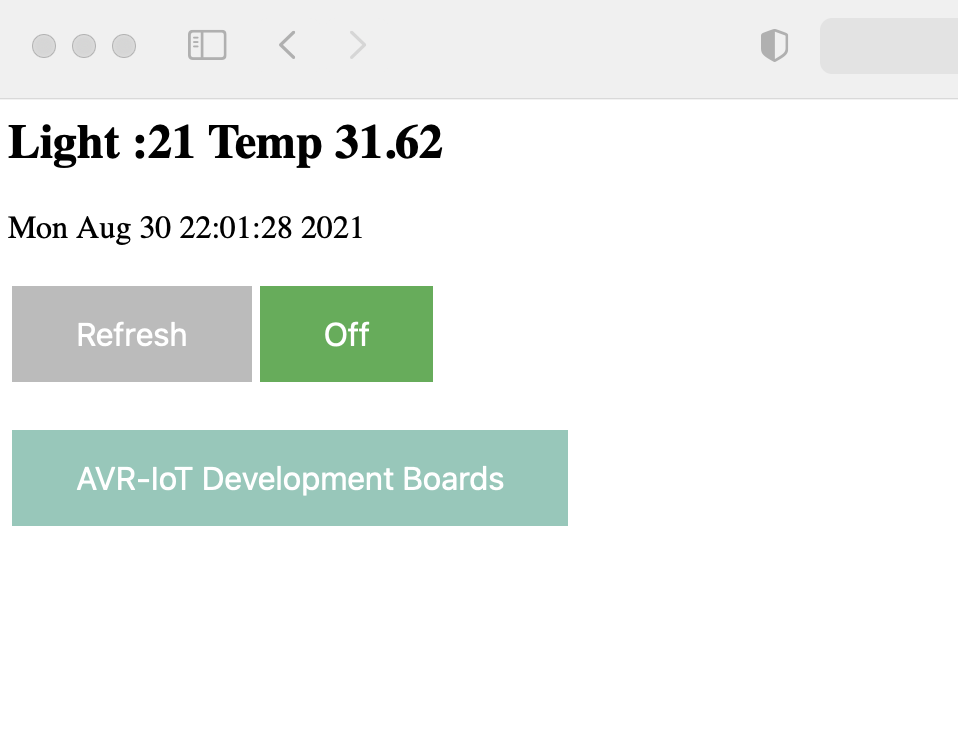

# Microchip AVR-IoT WA (Wireless for Amazon Web Services) with simple webserver

---
## Getting Start
+   This is Out of Box (https://github.com/microchip-pic-avr-solutions/avr-iot-aws-sensor-node-mplab) Microchip AVR-IoT WA operation on top run a simple http web server.
+   Only support http GET method and ATmega4808 only have small size of memory so that large contents will make the system halt (out of memory).

### Application Description
+  Create and modify the content at AVRIoT.X/webserver.c file, under the  ``uint16_t webserver_content(char* body, char* path)``function.

+ ``webserver_get_key_value(char* key,char* value)`` function is used for get "GET query" value by provide the key string.

+ The default web content come with a demo of show sensors value and a toggle switch for suspend/resume publish MQTT.

